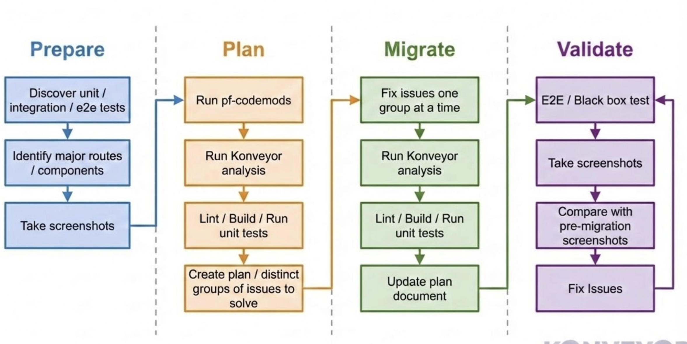
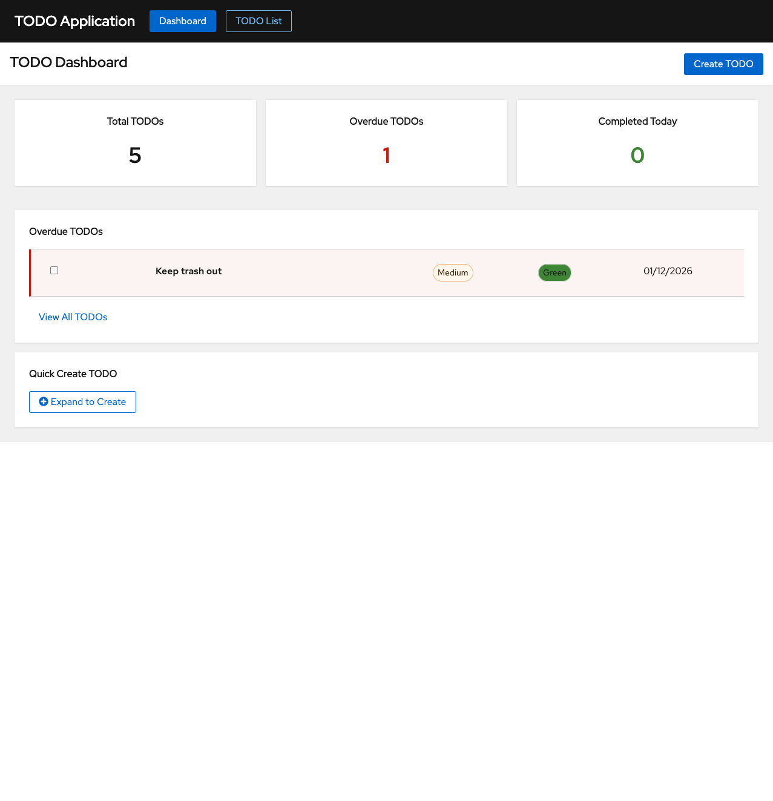
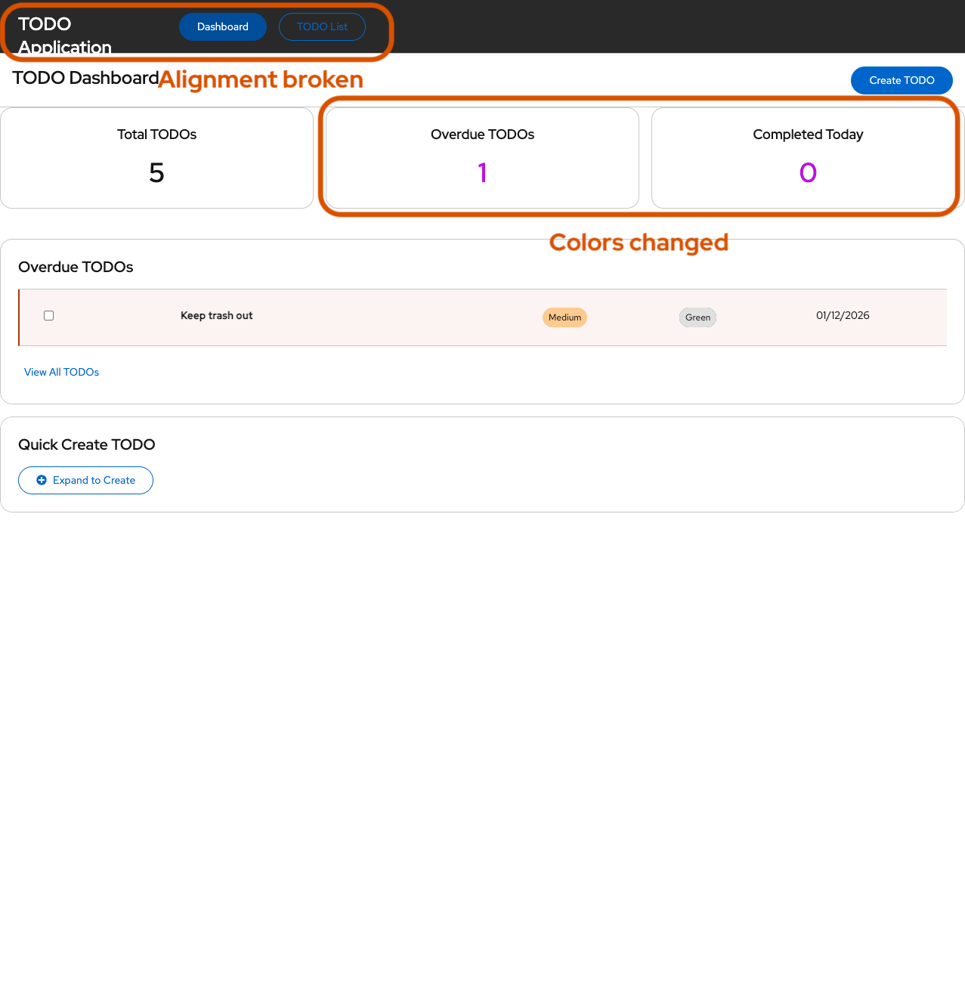
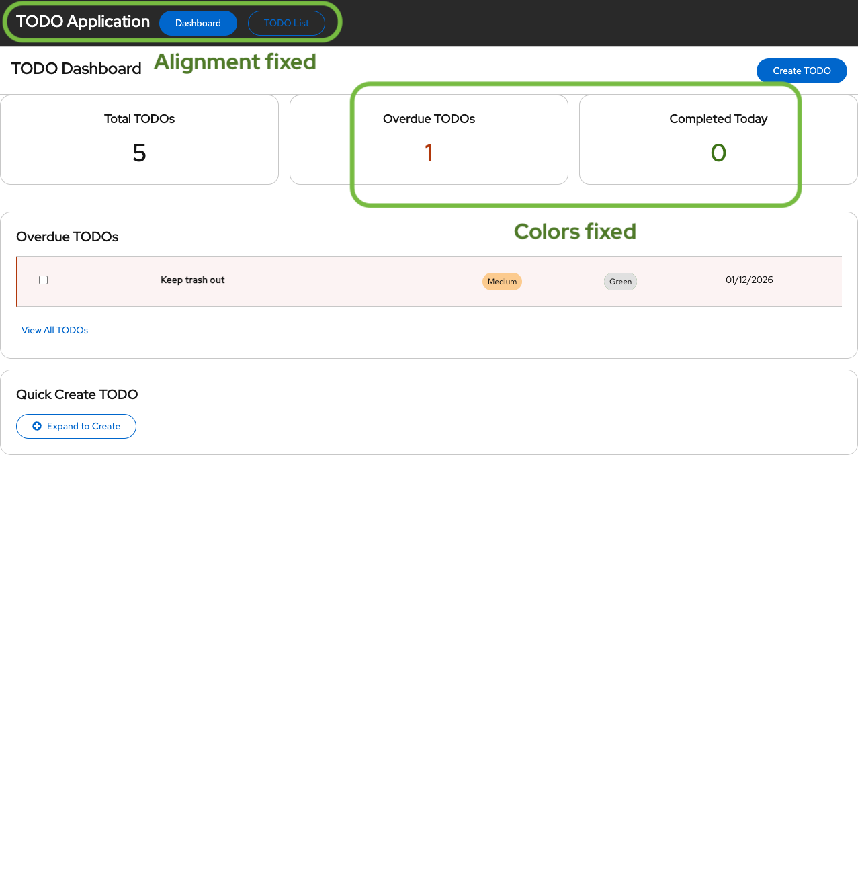

# Migrating a TODO App from PatternFly 5 to PatternFly 6

We used the [code migration recipe](../../goose/recipes/README.md) to migrate a TODO note-taking application from PatternFly 5 to PatternFly 6 end-to-end, without any manual code changes. The recipe replaced the usual back-and-forth prompting with a structured, repeatable workflow that handled everything from static analysis through visual regression testing. Along the way, the visual verification loop turned out to be the most impactful part -- it caught 40 UI regressions that no test or linter would have flagged, and fixed many of them autonomously.

---

## Table of Contents

- [Application Under Test](#application-under-test)
- [Workflow Overview](#workflow-overview)
- [Phase 1: Prepare](#phase-1-prepare)
  - [Project Discovery](#project-discovery)
  - [Visual Baseline Capture](#visual-baseline-capture)
- [Phase 2: Plan](#phase-2-plan)
  - [Running pf-codemods](#running-pf-codemods)
  - [Konveyor Static Analysis](#konveyor-static-analysis)
  - [Creating the Migration Plan](#creating-the-migration-plan)
- [Phase 3: Migrate](#phase-3-migrate)
- [Phase 4: Validate](#phase-4-validate)
  - [E2E Testing](#e2e-testing)
  - [Visual Comparison and Fix Loop](#visual-comparison-and-fix-loop)
- [Running the Recipe](#running-the-recipe)
- [Conclusions](#conclusions)

---

## Application Under Test

The target is a TODO note-taking app built with React and PatternFly 5. It features a dashboard with statistics cards, a TODO list with filtering and sorting, modals for creating/editing/deleting items, and 51 Playwright E2E tests.

Source: [mig-demo-apps/kai/nodejs/todo-app](https://github.com/pranavgaikwad/mig-demo-apps/tree/main/kai/nodejs/todo-app)

## Workflow Overview

The recipe follows a four-phase workflow: **Prepare**, **Plan**, **Migrate**, and **Validate**.



Each phase delegates to specialized subagents. The main agent orchestrates the flow, passes context between phases, and maintains a status document that tracks progress throughout.

---

## Phase 1: Prepare

### Project Discovery

A `project_explorer` subagent examines the application to discover the build system, test commands, lint configuration, dev server command, and project structure. This information is used by all subsequent phases.

### Visual Baseline Capture

Before any code is changed, a `visual_captures` subagent discovers the important UI components in the application and captures screenshots of each one. The subagent produces a [manifest.md](manifest.md) that catalogs every route, interactive component, and key UI element worth tracking:

| Type | Examples |
|------|----------|
| Routes | Dashboard (`/`), TODO List (`/todos`) |
| Modals | Create TODO, Edit TODO, Delete Confirmation |
| Forms | Quick Create TODO |
| Dropdowns | Priority Filter, Color Filter |

The manifest drives all subsequent screenshot capture. Screenshots are taken using the [Playwright MCP server](https://github.com/microsoft/playwright-mcp) to automate a real browser.

---

## Phase 2: Plan

### Running pf-codemods

The recipe first runs the official PatternFly codemods ESLint wrapper to auto-fix known migration patterns:

```bash
npx @patternfly/pf-codemods@latest <project_path> --v6 --fix
```

This handles straightforward API renames and import changes. However, codemods do not cover everything -- some changes are left for manual (or in this case, agent-driven) review.

### Konveyor Static Analysis

[Kantra](https://github.com/konveyor/kantra) is a static analysis tool from the [Konveyor](https://www.konveyor.io/) project. It runs rules against the source code to identify migration issues. For this experiment, custom rules from [konveyor/rulesets#347](https://github.com/konveyor/rulesets/pull/347) were used. These rules are designed to catch issues that remain *after* pf-codemods has run, such as:

- CSS token prefix changes (`--pf-v5-global--` to `--pf-t--global--`)
- CSS class prefix changes (`pf-v5-c-` to `pf-v6-c-`)
- Spacing and font semantic token replacements
- Color token updates
- Component API changes that codemods flag for manual review (e.g., `MenuToggle` variants, deprecated `Tile` imports, `MastheadBrand` to `MastheadLogo`)

A `kantra_command_builder` subagent constructs the correct analysis command flags based on the project type and migration goal.

### Creating the Migration Plan

After collecting issues from all sources (Kantra analysis, build errors, lint errors, test failures), the agent divides them into logical groups that can be addressed together. It writes a [status.md](status.md) file to disk that serves as both the plan and progress tracker. In this experiment, the issues were divided into 6 groups:

| Group | Description | Scope |
|-------|-------------|-------|
| 1 | CSS Token Prefix Updates | 10 files |
| 2 | CSS Class Prefix Updates | 8 files |
| 3 | Spacing & Font Token Updates | 7 files |
| 4 | Color Token Updates | Multiple SCSS/TSX files |
| 5 | Component API Changes | 3 files |
| 6 | Lint Errors | 4 files |

---

## Phase 3: Migrate

The agent works through the plan one group at a time. After fixing each group, it runs Kantra analysis, build, lint, and tests to verify the fix did not introduce new issues. It then updates [status.md](status.md) with the round results and moves to the next group.

The status document is the source of truth throughout migration. Each round log entry records what was fixed, whether new issues appeared, and the current state of build/lint/tests. See [status.md](status.md) for the full round-by-round log from this experiment.

If the same issue persists across 3+ rounds, an `issue_analyzer` subagent is invoked to determine whether the issue is fixable, a false positive, or needs manual attention.

---

## Phase 4: Validate

### E2E Testing

After all groups are complete, the agent runs the full E2E test suite. All 51 Playwright E2E tests passed after migration.

### Visual Comparison and Fix Loop

This is the most distinctive part of the workflow. After migration, the agent runs a structured loop to catch and fix visual regressions:

1. **Capture** post-migration screenshots of all components listed in the manifest
2. **Compare** them against the pre-migration baseline
3. **Fix** any differences, distinguishing between genuine regressions and expected PF6 design changes
4. **Repeat** until all issues are resolved

The `visual_compare` subagent generates a [visual-diff-report.md](visual-diff-report.md) with checkbox-tracked issues. The `visual_fix` subagent works through unchecked items, applies fixes, and logs what it did to [visual-fixes.md](visual-fixes.md).

In this experiment, the comparison found **40 visual issues** (2 major, 38 minor). The following dashboard screenshots illustrate the progression:

#### Pre-Migration (Baseline)

The original PF5 dashboard with correct header alignment and status colors.



#### Post-Migration (Before Visual Fix)

After code migration, the header text wraps to two lines and the stat colors changed to incorrect values. Annotations highlight the regressions.



#### After Visual Fix

The visual fix subagent corrected the header alignment and replaced incorrect color tokens with proper PF6 status colors. Annotations confirm the fixes.



Key fixes the visual fix subagent applied:

- **Header wrapping**: Added `white-space: nowrap` in `AppNav.scss` to prevent the title from breaking across lines
- **Color tokens**: Replaced `--pf-t--temp--dev--tbd` placeholders with correct PF6 status colors (`--pf-t--global--color--status--danger--default` for overdue, `--pf-t--global--color--status--success--default` for completed)
- **Missing screenshots**: Captured edit modal and delete confirmation modal screenshots that were missed in the initial post-migration capture

The full list of issues and fixes is documented in [visual-diff-report.md](visual-diff-report.md) and [visual-fixes.md](visual-fixes.md).

---

## Running the Recipe

See the [Goose recipes README](../../goose/recipes/README.md) for prerequisites and setup instructions.

```bash
goose run --interactive --recipe migration \
  --params source_tech="<source_technology>" \
  --params target_tech="<target_technology>" \
  --params input_path="<path_to_project>" \
  --params enable_default_rulesets=<true|false> \
  --params rules="<path_to_custom_rules>"
```

---

## Conclusions

1. **Structured workflow reduces manual effort.** The migration skill encodes the entire process -- discovery, analysis, planning, fixing, validation -- into a repeatable recipe rather than requiring back-and-forth prompting. The agent completed this migration with zero manual code changes, demonstrating the potential for scaling this approach across multiple applications.

2. **Visual verification catches what static analysis cannot.** The discovery-comparison-fix loop caught 40 visual regressions that would not have been detected by Kantra, build, or tests alone. Issues like incorrect color tokens and broken text alignment are only visible in rendered UI. Automating this loop improves the quality of migration and reduces manual work.

3. **The recipe generalizes across technology paths.** The migration skill parameterizes source and target technologies, rules, and project paths. The same workflow structure applies to any migration where static analysis rules exist. Target-specific guidance (e.g., running pf-codemods, visual regression testing) is isolated in separate files, making it straightforward to extend to new migration targets.
